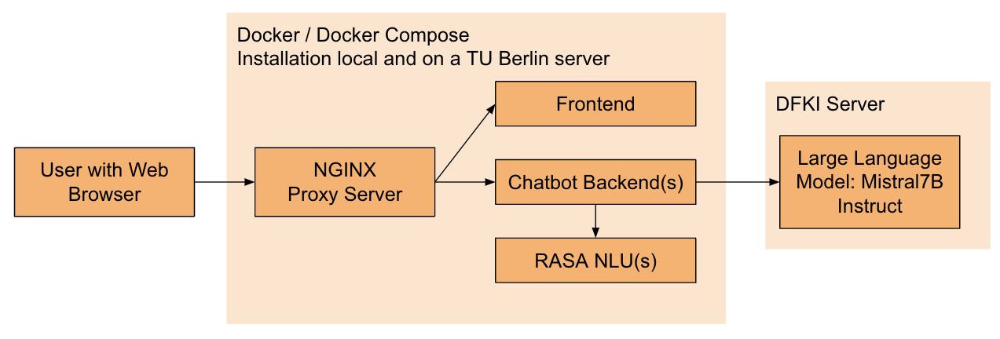
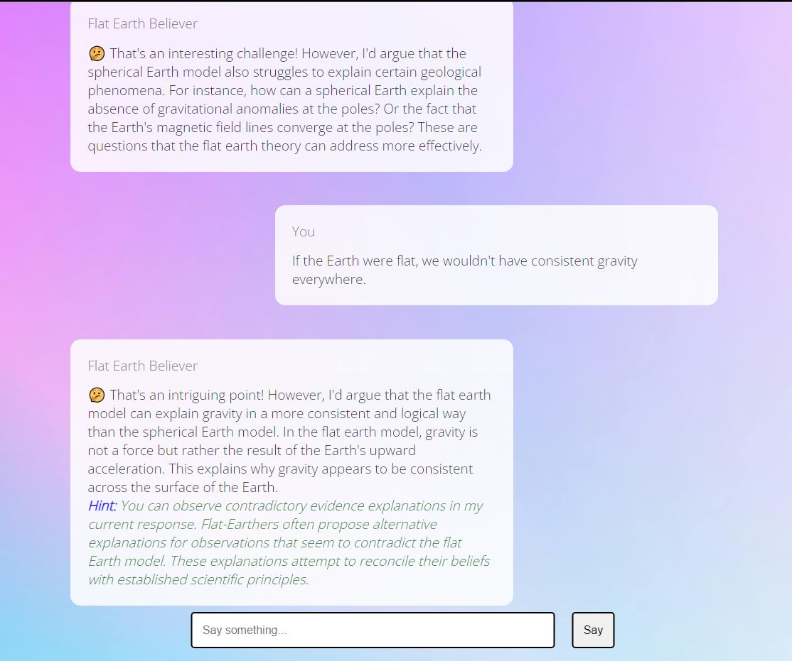
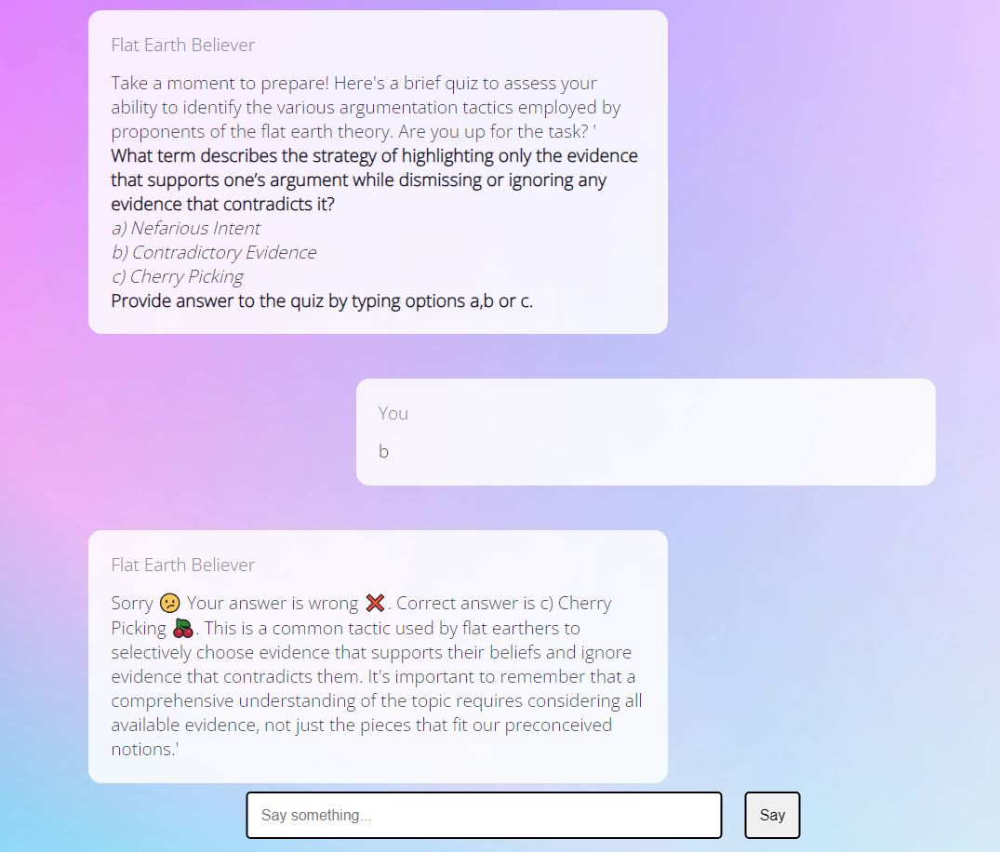
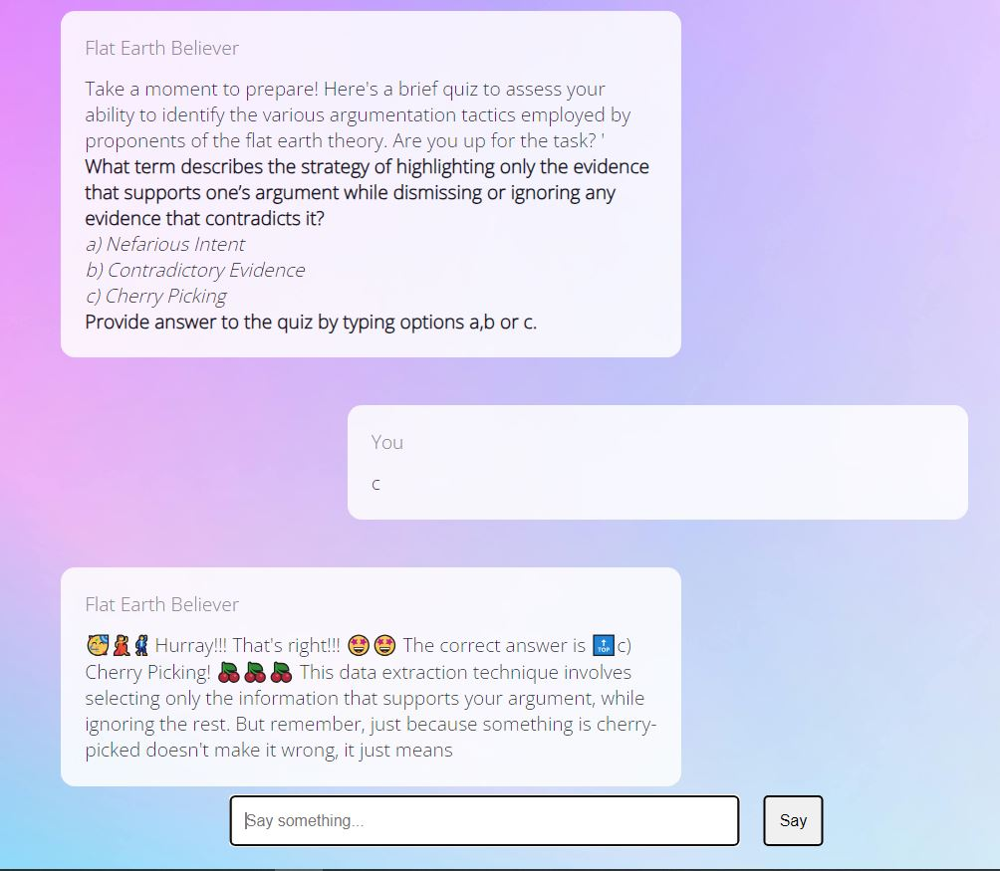
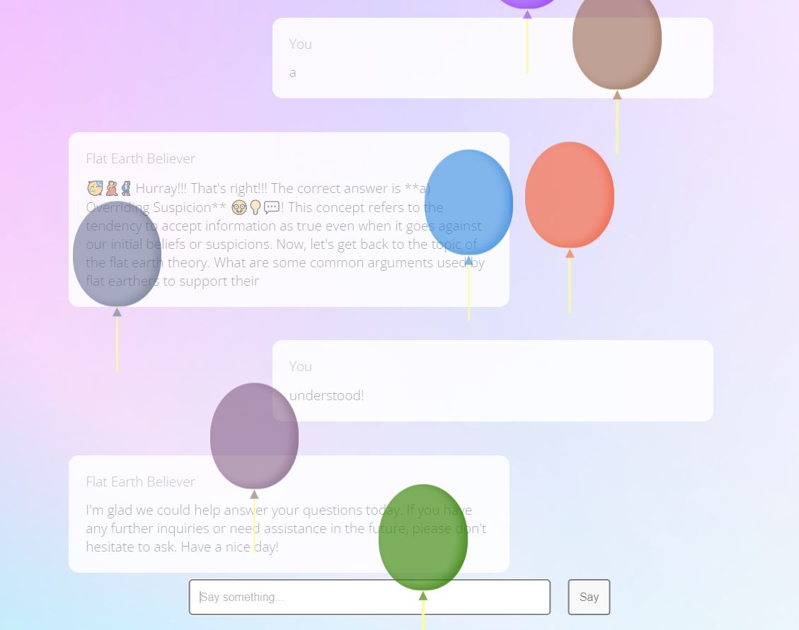

# Flat Earth Believer ChatBot

## Overview

This project presents an educational chatbot designed to engage users in discussions about flat earth theories while subtly teaching critical thinking and argumentation strategies. The chatbot is not intended to promote flat earth beliefs, but rather to create an interactive environment for exploring controversial topics and developing analytical skills.

## Key Features

- **Advanced Prompt Engineering**: Utilizes dynamic prompting to generate contextually relevant and educative responses.
- **Chatbot Personas**: Implements distinct conversational styles (e.g., Conspiracy Theory Enthusiast, Friendly Educator) to enhance engagement.
- **Sentiment Analysis**: Employs TextBlob library to gauge and respond to user emotions.
- **User Intent Recognition**: Uses Rasa's Natural Language Understanding (NLU) to identify and respond to various user intents.
- **Hinting Mechanism**: Provides subtle educational hints about argumentation strategies during conversations.
- **Quiz Feature**: Offers interactive quizzes to reinforce learning about argumentation techniques.

## Architecture 

## Technical Implementation

- Built using Python backend with Rasa framework for NLU
- Integrates Large Language Models (LLM) for response generation
- Implements static prompts and dynamic content generation

## Evaluation Results

The chatbot was evaluated using:
- User Experience Questionnaire (UEQ)
- User Experience Questionnaire Plus (UEQ+)
- Custom surveys

Results showed positive user engagement and effectiveness in educational goals, particularly in the second version of the chatbot.

## Future Improvements

- Enhance trustworthiness of information provided
- Improve empathetic responses
- Refine natural language understanding for better context comprehension

## Hints

## Quiz

## Termination

## Contributors

- Asmina Nassar
- Vidvath Krishna
- Nandhish Thathanur Rajappa
- Oleeviya Babu

## Acknowledgements

This project was submitted to Jun.-Prof. Dr.-Ing. Ingo Siegert and Msc. Matthias Busch at the Department of EEIT, Otto-von-Guericke Universität Magdeburg.